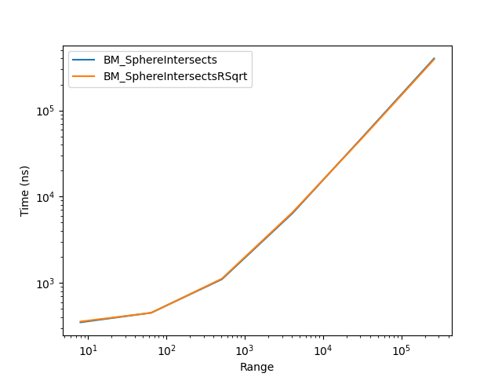

# Circle and sphere intersection optimization


## Intro

I worked on the circle and sphere optimization for a game engine. Those shapes are composed of two values, the center, and the radius.
Those shapes will be used later for the physics engine.

## Intersection

the intersect for the circle and sphere is the same except we need a third dimension for the sphere:
```cpp
struct Circle
{
    Vec2f center;
    float radius;
}

struct Sphere
{
    Vec3f center;
    float radius;
}
```
The intersection function is :
```cpp
bool Intersects(Circle circle) const
{
    Vec2f distanceVector = center - circle.center;
    float radiusSum = radius + circle.radius;

    float magnitude = distanceVector.Magnitude();
   
      return magnitude <= radiusSum;
}
```
So if the magnitude between the two circles is less or equal or the sum of the two radii it returns true.

I tried some way to implement this function, first, I know that the magnitude use a square root but it is an expensive task for the processor.

## Reverse square root

Because the square root function is expensive for the processor I wanted to find another way to find the result.

This function plays with the memory to return a really precise approximation(+-0.175%) of the square root.

```cpp
float Q_rsqrt(float number)
{
    long i;
    float x2, y;
    const float threehalfs = 1.5F;

    x2 = number * 0.5F;
    y  = number;
    i  = * ( long * ) &y;    // evil floating point bit level hacking
    i  = 0x5f3759df - ( i >> 1 );               // what the fuck? 
    y  = * ( float * ) &i;
    y  = y * ( threehalfs - ( x2 * y * y ) );   // 1st iteration
//  y  = y * ( threehalfs - ( x2 * y * y ) );   // 2nd iteration,
                                              // this can be removed
    return y;
}
```

> source : [The Legendary Fast Inverse Square Root](https://medium.com/hard-mode/the-legendary-fast-inverse-square-root-e51fee3b49d9)


I recommend reading [this article](https://medium.com/hard-mode/the-legendary-fast-inverse-square-root-e51fee3b49d9) about the reverse square root function to understand the black magic behind.

This function was firsts created by a programmer for Quake III to optimize 3D graphics, because they were using a lot of square root slowing drastically the game but with this function they were able to be four time faster.

# Second implementation

With this new square root function, I did a new version.

```cpp
bool IntersectsRSqrt(const Sphere sphere) const
{
    const Vec3f distanceVec = center - sphere.center;

    const float radiusSum = sphere.radius + radius;

    const float distance = RSqrt(distanceVec.x * distanceVec.x +
                                 distanceVec.y * distanceVec.y +
                                 distanceVec.z * distanceVec.z);

    return distance <= radiusSum;
}
```
> Here the second version of the Intersection function with a change in the way the function gets the magnitude.

## First result

I did the test between the [first function](https://ethancavadia.github.io/#intersection) and this second function.

But the result weren't conclusive, the second function being 1~ time slower for the circle and even for the sphere.

 

### Why it's not faster

I did my benchmark on quick-bench.com to see what is the assembly code behind and to see why it was not faster:

#### BM_SphereIntersects


> result of benchmark done on [quick-bench.com](http://quick-bench.com/)

In this instruction we can see that the "add" takes most of the time, meaning that it takes most of the time writing in memory.

And we can see that the "movaps" before the "sqrtss" take most of the time not the square root.

#### BM_SphereIntersectsRSqrt


> result of benchmark done on [quick-bench.com](http://quick-bench.com/)

Same as before but here with the "0x5f3759df" magic value to get the square root.

And the code is much longer.


## SIMD (Single Instruction Multiple Data)
So my problem is that it takes time to write data. I heard a way to process data where I could process multiple data at once.

This process is called SIMD operation :


Unlike scalar operation, SIMD operates with multiple value at once but I need to process the data differently.

## Array of Structure of Array

AoSoA is a layout of the memory in which data for different fields is interleaved using tiles or blocks with a size equal to the SIMD vector size of 64 bytes.
This appraoch of doing is more friendly with the Lcache and the SIMD port of the modern CPU.

### Array of Structure

The AoS is the most conventional memory layout.
```cpp
struct Sphere
{
    Vec3f centerX
    float radius;
}
```

### Structure of Array

SoA is a layout separating elements of a struct into one parallel array.
```cpp
struct Sphere
{
    std::vector<Vec3f> center;
    std::vector<float> radius;
}
```
If only a specific part of the record is needed, only those parts need to be iterated over, allowing more data to fit onto a single cache line. 
The downside is requiring more cache ways when traversing data, and inefficient indexed addressing.

### Array of Structure of Array

AoSoA is a layout of the memory in which data for different fields is interleaved using tiles or blocks with size equal to the power of 2, which allows us to use SIMD expression.
```cpp
struct Sphere
{
    std::array<float, 4> center;
    std::array<float, 4> radius;
}
```
This approach of doing is more friendly with the Lcache and the SIMD port of the modern CPU.

### FourCircle

Here is the application of AoSoA for the Circle.


### FourSphere

Here is the application of AoSoA for the Sphere.


# Intrinsics

Now that I have all my value-aligned i wanted to see if my functions of intersection could be faster by translating from C++ to intrinsics.

I have an I7-7700HQ GPU so I used SSE x86 intel intrinsics.

This function is the same as the C++ one but in intrinsics using four circle at once.
```cpp
inline uint8_t FourCircle::IntersectsIntrinsicsCircle(const FourCircle& circlesA, const FourCircle& circlesB)
{
    __m128 x1 = _mm_load_ps(circlesA.centerXs.data());
    __m128 y1 = _mm_load_ps(circlesA.centerYs.data());
    __m128 rad1 = _mm_load_ps(circlesA.radius.data());

    __m128 x2 = _mm_load_ps(circlesB.centerXs.data());
    __m128 y2 = _mm_load_ps(circlesB.centerYs.data());
    __m128 rad2 = _mm_load_ps(circlesB.radius.data());
    
    x1 = _mm_sub_ps(x1, x2);
    y1 = _mm_sub_ps(y1, y2);

    __m128 radSum = _mm_add_ps(rad1, rad2);

    __m128 distx = _mm_mul_ps(x1, x1);
    __m128 disty = _mm_mul_ps(y1, y1);

    __m128 dist = _mm_add_ps(distx, disty);

    __m128 mag = _mm_rsqrt_ps(dist);
    __m128 mask = _mm_cmple_ps(radSum, mag);

    uint8_t results = _mm_movemask_ps(mask);
    
    return results;
}
```
### __m128
__m128 is the 128 bit xmm register.

### ps
packed single_precision floating-points. is a 4 * 32-bit floating-point numbers stored as a 128-bit value.

This will be the value used by the intrinsic functions.

### _mm_load_ps()
Load 128-bits composed of 4 packed single-precision (32-bit) floating-point elements) from memory into memory destination. mem_addr must be aligned on a 16-byte boundary.

With _mm_load_ps() I load my 4 floats (4 * 4) from each to fill the 16-byte boundary of one ps.

### _mm_mul_ps()
The _mm_mul_ps function is multiplying a ps with another ps.

### _mm_add_ps()
The _mm_add_ps function is adding a ps with another ps.

### _mm_cmple_ps()
Compare the 4 values with the "<=" operator.

### _mm_movemask_ps
Set each bit of mask of the memory destination based on the most significant bit of the corresponding packed single-precision (32-bit) floating-point element in the argument.

I used the _mm_movemask_ps() to store the result of each circle to return it.

# Result
I created a test between four circle with four other circle :

#### BM_CircleIntersects vs BM_CircleIntersectsIntrinsics


> benchmark done on Windows 10, CPU I7-7700HQ

#### BM_SphereIntersects vs BM_SphereIntersectsIntrinsics


> benchmark done on Windows 10, CPU I7-7700HQ

The result given is that the intrinsic functions are slower if not iterate a lot of time.

# Conclusion

For the optimization to work it have to iterate a lot of time.

I learned a lot about data structures and assembly.

This was an interesting experience and made me get interested more about the thing I was looking for during the process of this project.